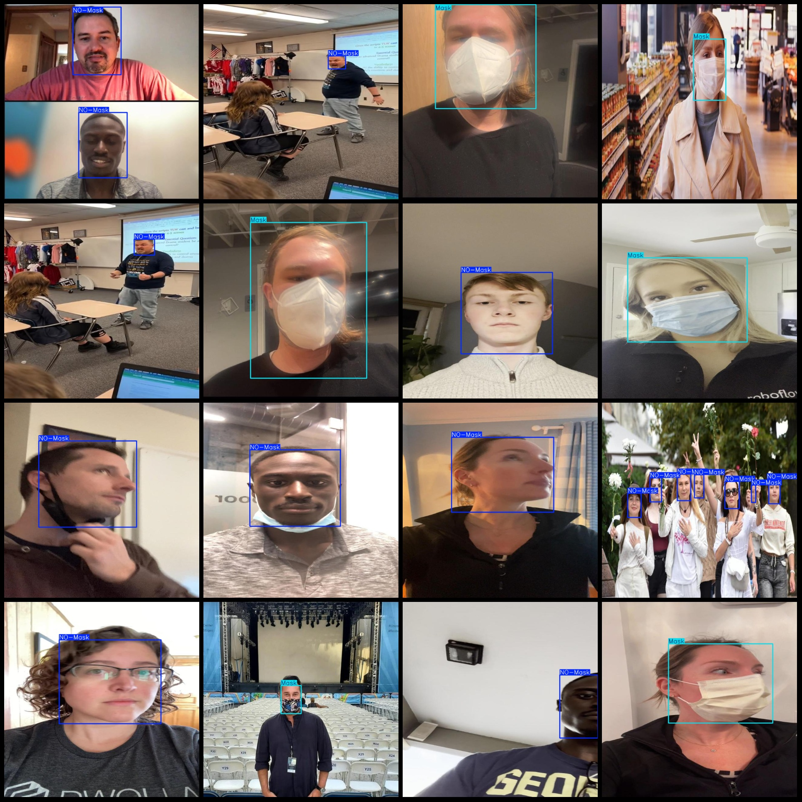
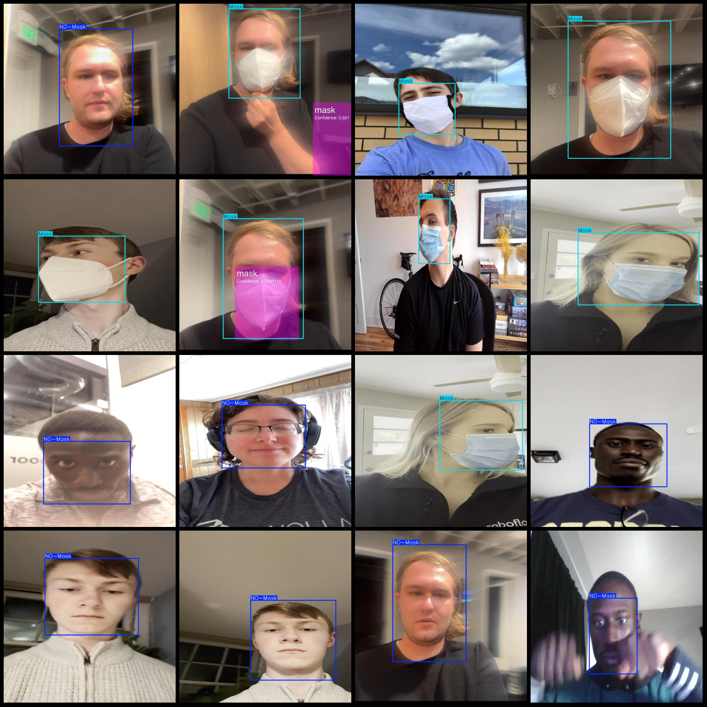

# Mask Wearing Detection Dataset (VOC+YOLO)

The dataset format is Pascal VOC with YOLO, without the split path of txt files. It only contains jpg images along with corresponding VOC xml files and YOLO txt files.

- Number of images (jpg file count): 1959
- Number of annotations (xml file count): 1959
- Number of annotations (txt file count): 1959
- Number of categories: 2
- Classification in the annotation txt file (note that the order of classes in the YOLO format does not match this, but refer to the "labels" folder's "classes.txt"): ["Mask", "NO-Mask"]
- Number of bounding boxes for each category:
  - Mask: 1513
  - NO-Mask: 1555
- Total number of bounding boxes: 3068
- Image resolution: 640x640
- Annotation tool used: labelImg
- Annotation rules: draw a bounding box for each category
- Important note: The dataset does not have a training/validation/test split, so you need to manually divide it.
- Special notice: This dataset does not guarantee the accuracy of the trained model or weight files.
- Image preview:

**Annotation Example**:

## Images

Here is a pay link on Stripe ( https://buy.stripe.com/3cs8yP7sY87d0vu9AB ). Please contact me lonlonago@foxmail.com after funding $89, and I will send you a complete data files , thank you!

